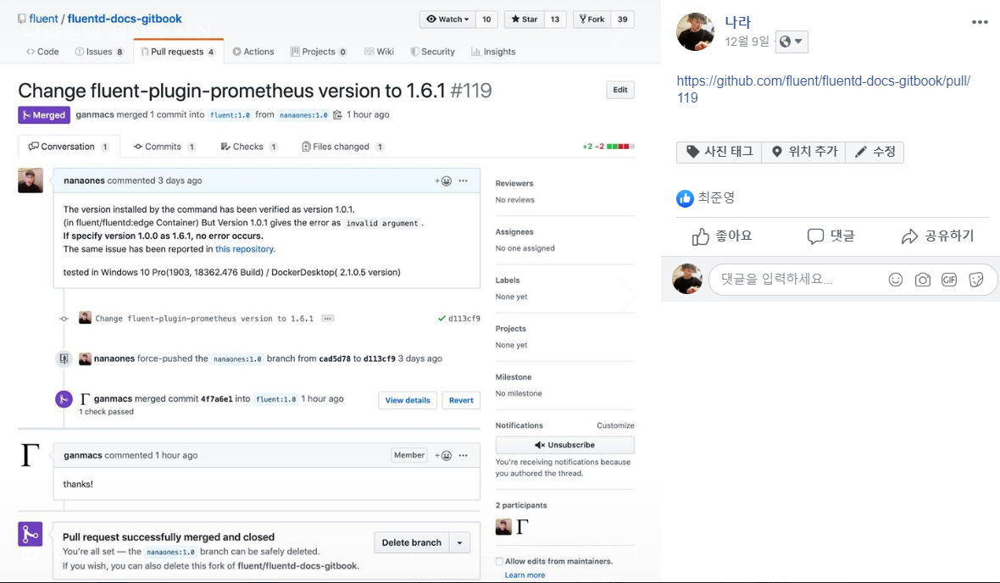

# 18 -19, 작은 개발자 성장기

구글과 페이스북이 나에게 작년 사진을 자꾸만 들이미는 시간이 되었다.  지난 사진들을 보니, 많은 기억과 ~~아찔했던 기억들이 주마등처럼...~~ 스쳐 지나갔다.   
생각보다 2018-19는 많은것을 이룬 해 이다.

## 아래 글을 읽기 전에,

아래의 시행착오를 겪고

저는 클린 아키텍쳐 책을 샀고, 

PostgreSQL Guide를 정독하였으며, 

테스트와 코드리뷰를 좋아하게 되었습니다.

또한, 모든 코드를 작성하기 전에 설계를 고민하게 되었으며, 성능을 늘 우선시하고 있습니다. 
걱정마세요 ... 

## 겪었던 수 많은 실패들

1. 설계는 프로그래밍의 기본이다. 

        ICON에서 Tx를 만들면 보상을 주는 이벤트를 했었다. 
        그리고, 그 DashBoard의 백엔드가 나에게 떨어졌다. 

    - CORS...? 이게 뭐에요

        "? 200 인데, 데이터가 안보여요"

    나는 Insomnia(RESTful API Client)로만 데이터 확인을 했었기 때문에 CORS 헤더를 까맣게 잊고 있었다. 때문에 API통신은 했는데, Cross-Origin Resource Sharing(CORS)처리 한 줄을 해 주지 않아서 프론트분이 내 서버와 통신은 했지만 데이터를 볼 수 없었다.

    - 개략적으로 내가 필요 스펙을 계산했어야했다.

        "아마, 가벼운 사양이면 충분할거에요, 나라씨 하고싶은대로 만들어보세요"

    이 말 하나만 믿고 SQLite를 사용했다. 

    뒤돌아서 계산해보니 7천500만개의 tx가 발생했었다. 이를 모두 분류해서 넣으려고 하니, 당연히 SQLite는 매일, 매 시간 터졌다.

    - 처리량 안되면 미들웨어 써라

        ""나라님... 데이터는 오는데, 너무 느려요"

    데이터가 서버에서 오는게 너무 느려서, 브라우저가 Not Respond 처리를 하였다.  

    코드를 전부 수정할 시간은 없었기 때문에 Gunicorn의 Gevent워커를 사용해서 나에게 주어진 t2.medium EC2 인스턴스의 코어를 모두 사용하였다. 혹시 몰라, NginX또한 설정하였다. 

    - 설계의 중요성

        "어라... 이거 API가 왜 이렇게 느리지?"

    원하는 값들을 드디어 뱉어내기 시작한 API들, 하지만 생각보다 속도가 너무 느렸다.

    코드를 다시 확인 해 보니, 300여개에 달하는 팀의 전체 현황을 보여주는 DashBoard에서 쿼리를 for문으로 돌리고 있었다. 

    매 페이지를 로딩할 때 마다 300개의 for문이 돌아가고 있었다. 

    - DB 설계의 중요성

        "어라... 이거 API가 왜 이렇게 느리지? * 2"

    for문을 돌리는 무지한 (...) 쿼리문을 새로운 쿼리로 교체했다. 

    하지만, 그럼에도 속도는 썩 좋아지지 않았다. 
    평소 친한 DBA 형에게 물어봤다. 

        "이게 뭐야 .... 얌마, 너 설계는 했냐?"

    덕분에 DB 설계 수업을 들었다. ~~(형 너무 고맙고 사...감사하고 그래요 ... )~~

    크게 혼나고 DB를 SQLite에서 PostgreSQL로 바꾸고 재설계했다. 

2. 동영상 강의 감사하면서 보자... 

        포항공대에 올라갈 Mooc 온라인강의 제작에 참여하였다. 
        주제는 블록체인... 
    ~~(이라고 쓰고 ICON이라고 읽는다.)~~

    - 시리 ...

        "강의에서 이상한 소리가 나오는데요?"

    그럴리 없는데... 강의자료를 녹음실에서 녹음하고 전달한 다음날 포항공대에서 피드백이 왔다. 

    강의 녹음을 하루 종일 하고 있었는데(출근을 아예 녹음실로 했다.) 하필, 한 번에 녹음해야하는 양이 6분짜리인 마지막 슬라이드의 중간 지점에서 자꾸 시리가 대답을 했다.

     세 번 쯤 반복되다 보니 "으아아아아아아ㅏ아아아" 하고 소리지르며 절규했고 마감시간이 가까워져, 복잡하고, 혼잡한 와중에 

    나의 절규는 그대로 녹음되어 포항공대로 보내졌다. 

    다음날 다시 녹음실로 갔다. (~~나중에 교수님이 밥사주시면서 누가 소리지른 분이냐고 물어보셨다.... 잊어주세요 ... 제발...~~)

3. 발표는 어려워

    원래 내성적인 성격을 지닌 나는, 잘 말을 하지 않는데 이상하게 전회사에 취직하고
    ICONLoop로 전직하는 2018-19년에 많은 사람들 앞에서 발표해야할 자리가 많이 생겼다. 

- 매주 개발자분들에게 발표

        "강사님... 좀 쉬셔야 할 것 같던데..."

    보기보다 목이 약하다. 

    ICON으로 전직한 이후에는 ICON Developers Workshop 이라는 주제로 4~6시간동안 개발자분들 앞에서 발표를 해야했고, 3시간이 지나면 어김없이 목소리는 노래방 다녀온것 처럼 갈라지고 있었다. 

    WorkShop 끝날때가 된다면 늘 갈라진다는 단점을 보완하고자, 마이크를 샀다. 

    나의모습, 영락없는 예비군 동대장님이었다.

    

그 뒤로 가능한 말로 설명하기 보단, GitHub에 설명을 자세히 쓰는 것 으로 대체했다. 

---

## (겪었던)겪고있는 작은 성공들

1. **좋은 동료와 만난 것**

    2018. 08 전회사에서 같이 시작한 좋은 동료 개발자분들이 지금 회사로 전직한 이후인 지금에도 성장에 가장 큰 성공 이라고 생각한다. 

     꼼꼼한 준영님은 코드 한 줄 한 줄 잘 봐 주시고, 심지어 영문법도 고쳐주시는 자상함을 가지셨다. 서로 아키텍처와 성능에 대한 이야기를 많이 주고 받았으며, 기술에 대한 이해도를 서로 질답하면서 향상시킬 수 있었다. 새롭게 조명받는 기술 트랜드 들과, 성능향상, 최적화에 대한 우리의 토론에는 늘 존중과 배려가 있었으며, 이러한 과정에서 나는 더 큰 성장을 위한 자극을 받았다. 
     늘 감사하다고 말씀드리지만, 이 글에서도 감사의 말씀을 전한다.

     *현재 같이하고 있진 않지만, 미디움에 글 올릴 때 마다 격려해주고, 상냥하고 따뜻하게 날카로운  질문 해 주시던 지인님에게도 감사의 말씀을 전합니다.* 

2. **큰 행사에서 발표들 [DEVSTAMP 등등...]**

    내성적인 성격 탓에, 발표는 늘 어렵고 힘들었다.

     하지만, 발표를 준비하는 과정에서 혼자 하는 공부와는 다른 많은것을 얻었다. 남들에게 보여주기위한 코드를 짠다는건 나에게 침대를 멀리하게 만들었으며,  

     발표를 듣는 입장에서 생각하게 만들었다. 소위 말하는 '읽기 좋은 코드'에 대한 고민과 토론을 끊임없이 만들었고, 이어나가게 만들었다.  

3. **유투브에 블록체인~~(이라고 쓰고 ICON...)~~ 강의 [포항공대 Mooc 강의]**

    내가 유투브에 강의를 올리게 되다니... 이런건 10년이 지나도 못할 줄 알았다. 

    한 분야에 관련된 내용을 전문적으로 설명한다는건 나에게 아주 무겁게 다가왔으며, 큰 행사에서의 발표들과 마찬가지로 아주 열심히(...) 준비하게 만들었다. 

4. **오픈소스 기여(~~비록 가이드 한 줄 이지만...~~) [fluentd promethoeus]**

     별 거 아닌데, 사실 자랑하고싶다. 

    내가 만든 서버의 응답속도를 확인하고, 실제 사용자분들이 많이 사용하는 API가 무언지, 응답속도는 어떻게 되는지 궁금해서 로그를 분석하기 시작했는데, 나 이외의 사람들에게 공유하고싶고, 그래프를 통해서 더 쉽게 보고싶어서 시각화 툴을 알아보고 있었다. 

     도중에, Prometheus와 Grafana를 연결하여 시각화하는 실습을 하게 되었고, 실습 과정에서 Fluentd의 설치가 제대로 되지 않는 문제를 발견했다. docker-compose logs 를 확인해 보니, 이는 버전 문제였다. Fluentd공식 Guide에 올려두었기 때문에, 나와같은 개발자가 막히면 서러워 할 것을 생각해 PR을 날리게 되었다. 

     감사하게도, Fluentd는 Merge 해 주었고 나는 이제부터 오픈소스에 발생할 수 있는 문제점을 찾아 헤매이는 한 마리의 하이에나... 가 될것 같다. 

    

    아직도 떨린다 ㅋㅋㅋ

5. 1일 1커밋 시작

    자주보는 개발 블로그의( 사실 인터뷰 내용과 블로그 내용이 동일한것을 보고 알아챘다.) 개발자분을 보고 따라하기 시작했다. 

     

6. 늘 성장하기 위해서 시도하는 꿈틀거림

---

## 나의 변화

### 내면의 성장~~과 외면의 성장(🐖)~~

첫 회사에 취직할 당시만 하여도, 연구실과 첫 회사에서 만들어진 안좋은 습관이 남아있었다. 

    그냥 돌아가면 그만, 
    잘 돌아가면 그만, 
    코드 형상관리..? 그런게 왜 필요해 ? 
    컨벤션? 그거 왜 지켜?'
    코드리뷰? 시간만 더 들지
    설계..? 그런거 다 머릿속에 있어

이랬던 내가, 아래같이 변했다. 

    `코딩, 그거 만들어놓은게 돌아가기만 하면 되는거 아닙니까?` 
     —> 준영씨 이거 어떻게 생각해요? 이렇게 구현되는게 더 빠르지 않을까요?
    
    `만들어놓은 API 응답만 잘 오면 되는거 아닙니까?`
     —> 벤치마킹 했더니 전보다 속도가 줄었어요...더 빠른게 없을까요?
    
    `깃 써야해요? `
     —> -잔디밭 꾸미는중-
    
    `컨벤션 ... 돌아가기만 하면 되는거잖아요`
     —> 이거 어때요? 혹시 컨벤션 틀린거 있으면 이슈 달아주세요 
    
    `코드리뷰 다 좋은데 할 시간이 없잖아요... `
     —> 이거좀 봐주세요 ㅜㅜ
    
    `이거 간단한건데 굳이 그렇게 설계할 필요 없어보이는데요?`
     —> 이거 시퀀스 다이어그램부터 그리고 들어가시죠 다 그리면 보내드릴테니 검토좀 부탁드릴게요

~~왠지 점점 더 준영님을 잘 괴롭히는것 같다.~~

### Docker 와의 만남🐳

삽질을 좋아하는 편 이고, 여러가지 툴들을 쓰는걸 좋아했다. 

맥이 아닌 노트북에 OS X를 설치하여 사용할 만큼 이것저것 설치하는걸 좋아했는데, 이런 나에겐 가장 큰 고민이 '설치하다가 꼬일때' 였다. 

 답이 없이 그냥 다 밀고 다시 설치한 경우도 많았다. (대학시절, 처음 윈도우에 JDK 설치할 때, 환경변수 설정 잘 못 해서 다른 환경변수를 모르고 다 지운적이 있었다.... 결국 윈도우 재설치)

**그런 나에게 Docker는 가장 큰 변화였다.** 

    $ docker run -it --rm -p 9000:9000 iconloop/tbears:mainnet 

한 방이면, ICONLoop의 tbears 개발환경이 모두 설치된 이미지를 dockerHub로부터 pull 하여 컨테이너가 실행된다. rm옵션으로, 끄면 아예 흔적도 남지 않고 깔끔하게 지워진다. 

심지어, VSCode를 사용하면, 이러한 컨테어너에 접속해서 컨테이너 내부의 파이썬 인터프리터를 기반으로 코딩할 수 있다. (Pylint도 당연히 컨테이너 내부설정을 따라간다.)

덕분에, 내가 했던 고생을 다른분들이 안했으면 좋겠다는 생각에 이런 글도 써서 공유했었다.

[윈도우에서 ICON 개발환경 구축하기-2](https://medium.com/b-ock-chain/%EC%9C%88%EB%8F%84%EC%9A%B0%EC%97%90%EC%84%9C-icon-%EA%B0%9C%EB%B0%9C%ED%99%98%EA%B2%BD-%EA%B5%AC%EC%B6%95%ED%95%98%EA%B8%B0-2-f32217e365f1)

[윈도우에서 ICON 개발환경구축하기](https://medium.com/b-ock-chain/%EC%9C%88%EB%8F%84%EC%9A%B0%EC%97%90%EC%84%9C-icon-%EA%B0%9C%EB%B0%9C%ED%99%98%EA%B2%BD%EA%B5%AC%EC%B6%95%ED%95%98%EA%B8%B0-78c1f4042aba)

### 오픈소스 노려보기🤳

우연이 이어지면 필연이 된다고 한다. 

지난번 우연히 했던 컨트리뷰팅을 필연으로 만들어 나가기 위해서 사용하는 오픈소스들에 대한 검증과 기여를 늘 염두에 두고 사용할 것이다.